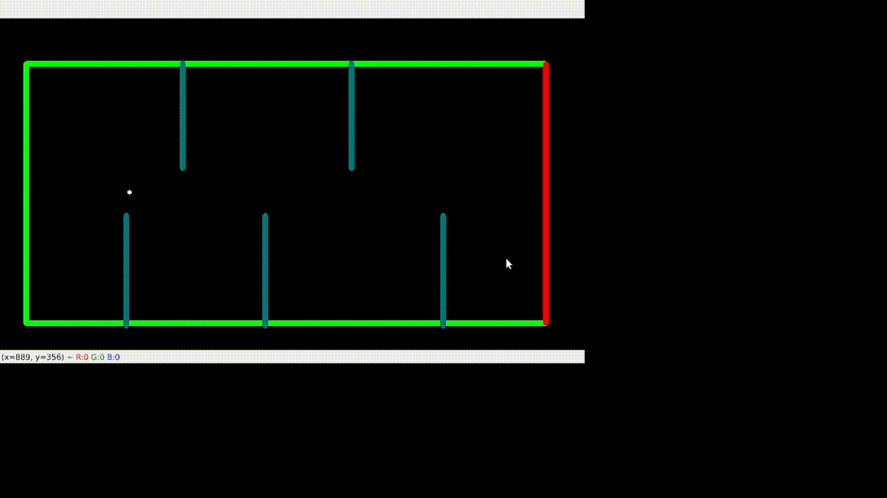

### Dots And Lines - The Bird Dot game

**Contents**
 - Wiki
    - Description
    - Environemnt
    - Observation
    - Action
    - Rewards
    - Starting State
    - Episode Termination

 - Experiment Procedure and Results
    - Train in Local
    - Inference in Local
    - Graph
    - Youtube Link

**Wiki**

- Name: The Bird Dot game
- Category: Box2D

**GIF's**

 

**Description :**
- Uses discrete action space
- Boundaries are the collision points
- Dot should move towards green line and reach it

**Environment**

Stimulator: OpenCV
*Note : In opencv origin starts from top left corner

Map : 512x512x3 dimension

**Observation**

Type : Box(20)

| Num | Observation | Min | Max | Mean|
| --- | ----------  | --- | --  | --- |
|  0  |    head_x   |  0    | 512    | 256    |
|  1  |    heady_y  |  0    | 512    | 256    |
|  2  |    delta_x(dest)   |  0    |  512   | 256    |
|  3  |    delta_y(dest)   |  0    |  512   | 256    |
|  4 - 18  |    previous_moves | 0    |  3   | 1 |

**Action**

Type : Box(4)

| Num | Action | Min | Max |
| --- | ----------  | --- | --  |
|  0  |    left   |  0    | 1    |
|  1  |    right  |  0    | 1    |
|  2  |    up   |  0    |  1   |
|  3  |    down   |  0    |  1   |
|  4  |    up-right   |  0    |  1   |
|  5  |    down-right   |  0    |  1   |

**Rewards**
| Situation | Points |
| ------    | ------ |
|   Collision with boundaries  |   -40     |
|   Fetching food              |   score*1000   |
|   Moving towards food        |   1     |
|   Moving away from food      |   -1     |

**Starting State**

- Origin - (59,268)

**Episode Termination**
- case 1 : Collision with boundaries
- case 2 : Collision with hindrences

#### Execution Procedure

**Train in Local**
- python3 train.py > record.txt
- *For faster training comment out cv.imshow(self.img) , cv.waitKey() in code*
*You can view rewards for each timestep and other episode details in record.txt*

**Inference in Local**
- python3 inference.py

**Graph**

To be done

